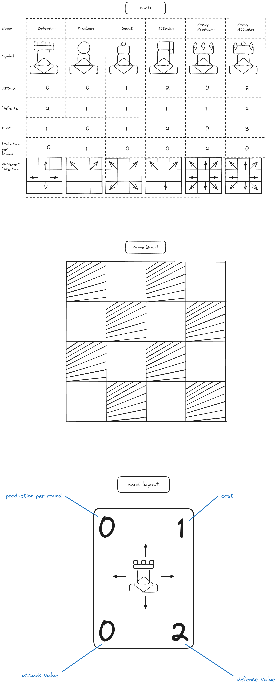

The game board is placed with players on opposites sides.
Each player has a deck of any 5 cards from defenders, producers, scouts, heavy producers, or heavy attackers pre selected before the match. (neither player knows what eachothers' decks contain)
There exists a deck of and infinite number of cards efectively shuffled and face down.
The goal of the game is to defeat all your opponents peices by the end of a round
    

A round consists of Three major phases:
    
    PHASE 1 - The Placement Phase

    At the begining of the Placement Phase players add up all the production values their pieces produce noted in the top left of the pieces card.
    This value enters that players production pool for the round.
    Players take turns placing pieces coresponding to cards in hand.
    Each piece has a cost noted in the to right of the card.
    A piece may only be placed on an empty square.
    Once a piece is placed subtract its cost value from its players production pool.
    Once a piece is placed the player puts the coresponding card into their discard pile.
    The placement phase is over once both players run out of production value to spend or cards to place.

    PHASE 2 - The Action Phase

    Players take turns taking actions using the pieces according to the piece's rules.
    The rules are represented on the card.
    A player may only move one piece per turn.
    A piece may move one space in any direction printed on its card per turn.
    A player may move any piece as long as it is their turn.
    A piece may move only once per Action Phase.
    Once a player passes turn prior to their opponent passing turn after taking no actions the Action phase is over and the end phase begins

    PHASE 3 - The Draft Phase

    PLayers Draw 6 cards together from the infinite deck and place them face up so both players can see all 6 cards
    They take turns selecting one card and place that card into their discard pile.
    Players then shuffle their discard into their deck and draw 5 cards.
    The Placement phase begins

   

